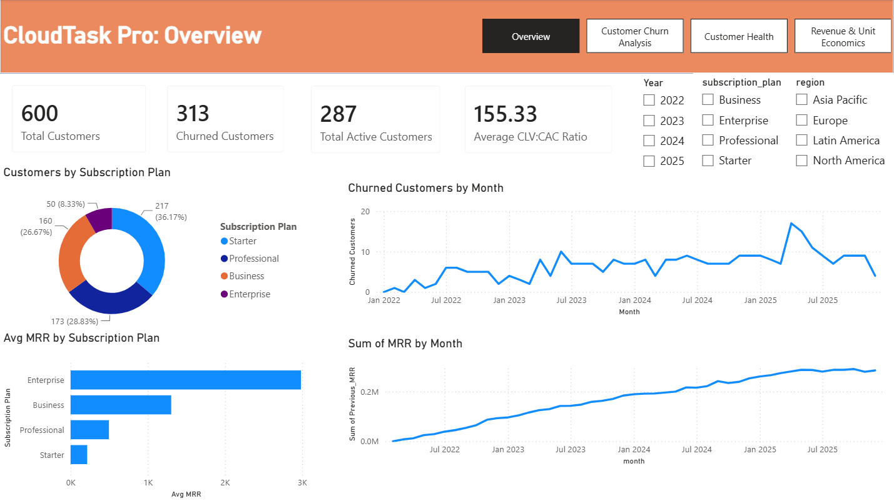
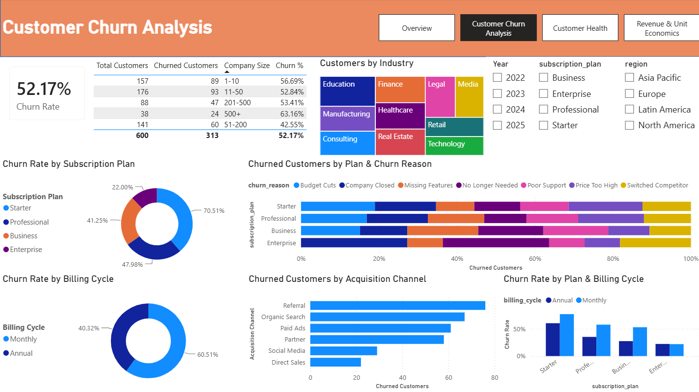
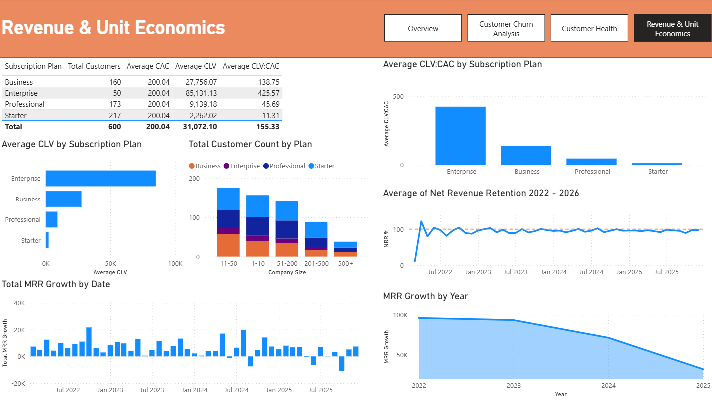
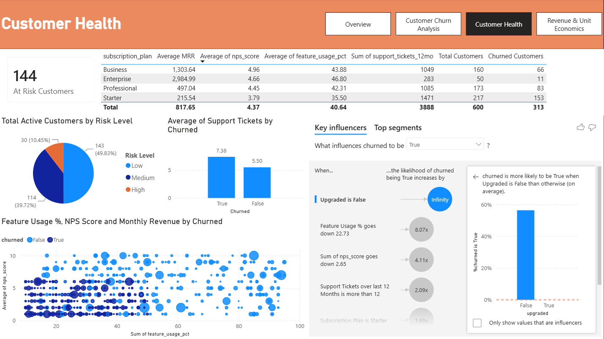

# SaaS Revenue Churn Analysis: "CloudTask Pro"

## Overview:
CloudTask Pro is a SaaS company that has grown from 0 to 600 customers since 2022. While revenue has been growing, the board has raised concerns about a high churn rate. The CFO wants to understand the monthly churn trends, which customer segments are most at risk, and what the company’s unit economics look like (MRR, customer acquisition cost vs. lifetime value).
1. What is the overall churn rate, and how has the monthly churn rate trended over the past 4 years? Is churn improving or getting worse?
2. Which subscription plan (Starter, Professional, Business, Enterprise) has the highest churn rate? Does billing cycle (monthly vs. annual) significantly impact retention?
3. What are the top 3 reasons customers churn, and do these reasons differ by plan type or company size?
4. Calculate the average Customer Lifetime Value (CLV) by plan. Compare this to the Customer Acquisition Cost (CAC). Which plans are the most and least profitable?

**Initial Key Findings**
- While CloudTask Pro has acquired its 600th total customer, 313 customers have left since 2022 leaving 287 active customers as of today. This results in an alarmingly high 52.17 overall churn rate. Essentially, for every new customer that is acquired, one departs.
- Enterprise plan customers are seeing the lowest rate of departures at 22%.
    - Because of high churn rates, the following business segments are especially at-risk:
    - The cheapest offering, the Starter Plan, is seeing a 70.51% churn rate. 7 out of 10 customers who enroll in the entry experience are leaving.
    - Monthly plans are seeing a churn rate 20 percentage points higher than those who sign up for the annual commitment, at 60.51%.

**Business Impact**
- Brand Reputation damage: Customers acquired through referral make up the highest percentage of customers who leave at 24%, compared to all other acquisition channels. Despite being sold on the product by a friend or mutual connection, these customers are still leaving at the highest rate which can negatively affect brand reputation by word-of-mouth over time.
- Enterprise retention appears relatively stable regardless of contract length, suggesting that product integration and business value are stronger retention drivers than contractual commitment.

## Churn

**Key Findings**
- The data shows the top 3 reasons for customer churn are budget cuts, high pricing, and companies closing.
- All three of the top reasons are especially impacting the Starter and Professional Plans.
- The Business Plan sees churn primarily to Missing Features and Poor Support. Though a smaller sample size, we are seeing larger Enterprise customers primarily leave due to “no longer need” or “company closed”.
- No company that has a feature usage percentage over 50% has churned.

**Business Impact**
- While two of the top three reasons for churn are for external/economic reasons, the pricing structure is within CloudTask Pro’s control to fix. This indicates that customers are not necessarily leaving because of dissatisfaction with the product, but because the return on investment may not be high enough.
- The numbers indicate for the Enterprise segment, it is less about the product and service and more about changes in their structure.

**Strategic Recommendations**
- Introduce a discount or incentive for the Annual commitment. The majority of customer subscriptions have been Monthly (~58%). In order to address the high churn rate of these Monthly plans (60.51%), customers should be incentivized (i.e. a discount) to switch to the Annual commitment.
- The addition of a Customer Success Team could help with retention. In the large enterprise category of the customer base (500+ employees), over 63% have departed. This should be a reliable, profitable segment for CloudTask. The high churn suggests the product may not meet their needs, or there is a disconnect in discovering its value for larger firms.
- Audit the Starter and Professional Plans. At 70% & 48% failure rates, we should re-look at what these plan levels offer. Either features should be expanded, or prices readjusted. Beyond external economic conditions, exit data shows the entry level plans are churning primarily due to price or switching to a competitor.
- Highlight feature usage. As no plan over 50% feature usage has churned, firms that take advantage of CloudTask’s features and abilities are finding reason to stay. CloudTask may need to look at its onboarding process, and better educate customers on leveraging the software.

## Revenue & Unit Economics

**Key Findings**
- The Enterprise Plan holds a Customer Lifetime Value (CLV) to Customer Acquisition Cost (CAC) ratio of 423:1, the highest CLV/CAC ratio of the current plan offerings
- All plans are profitable, though the Professional and Starter Plans much less so with the most churn
- The Starter Plan has a CLV/CAC at 11.25:1. While this remains above the generally accepted benchmark of 3:1 for the industry, it is by far the lowest of the plan offerings at CloudTask Pro.
- Interestingly, there have been 38 customers with companies over 500 employees. 14 are still with CloudTask. None of these 38 have been on Enterprise. CloudTask’s largest clients are not signing up under the Enterprise Plan, the most profitable and least churning plan offered.
- Net Revenue Retention exceeded 100% in only 10 months since the company launched in March 2022, indicating that existing customer revenue has declined in most months.
 
*Because the dataset does not include Expansion MRR (upsells) or Contraction MRR (downgrades), Net Revenue Retention was estimated using Current MRR, Previous Month MRR, and New Business MRR. In a production SaaS environment, a true NRR calculation would also account for expansion and contraction revenue.*

*The dataset provides a single monthly average CAC rather than plan-specific acquisition costs. Therefore, CLV:CAC ratios are compared against the overall average CAC.*

**Business Impact**
- The Enterprise Plan is by far the most profitable segment, with the same cost to acquire these customers as other plan offerings. For every $1 spent on acquisition, CloudTask Pro generates roughly $423 in lifetime value.
- Despite the Enterprise Plan returning nearly 37x the value of the Starter plan, its costs CloudTask Pro the same amount to acquire customers
- The NRR data suggests the company relies heavily on acquiring new customers to sustain revenue growth rather than expanding or retaining revenue from its current customer base.

**Strategic Recommendations**
- Cost of customer acquisition remains the same between the 4 plans, with stark differences in ROI. Given this, CloudTask should consider reallocating a major portion of the acquisition budget to the larger, more robust Business and Enterprise plans.
- While the Starter Plan is clearly not as profitable as the other three plans, it remains true it is still the largest customer segment at 217 paid plans. Rollback spending on acquisition here, and focus on addressing the root cause of the extremely high level of churn to retain the customer base they do have. The byproduct of this will increase CLV and the profitability of CloudTask’s largest customer segment.

## Customer Health

**Key Findings**
- Lower use of average feature usage percentage correlates with higher churn
- Lower average NPS score correlates with higher churn
- The number of support tickets are significantly higher for customers who eventually churned than those who are still active
- Based on the customer health model (described below), over half of the active customer base identifies as medium to high level risk of departing CloudTask.

**Business Impact**
- I developed a simple customer health model by assigning one risk point for low feature usage, low NPS, and high support ticket volume. Customers with two or more risk factors were classified as at risk. This model was then used to identify active customers who could benefit from proactive retention efforts.
    - Feature Usage < 40%
    - NPS < 30
    - Support Tickets > 8
- For example, someone with excellent product usage but terrible NPS may still deserve outreach, and someone with average NPS but a flood of support tickets might also be at risk.

**While CloudTask Pro has successfully grown revenue through customer acquisition, long-term growth is constrained by customer retention. High churn among smaller subscription plans limits the company's ability to consistently grow revenue from existing customers, causing Net Revenue Retention to remain below 100% in most months. Retention initiatives focused on Starter, Professional, and Business customers, particularly those on monthly contracts, represent the greatest opportunity to improve sustainable revenue growth.**

PROCESS
- Data exploration
- Data cleaning
- Excel
- SQL
- Power BI

